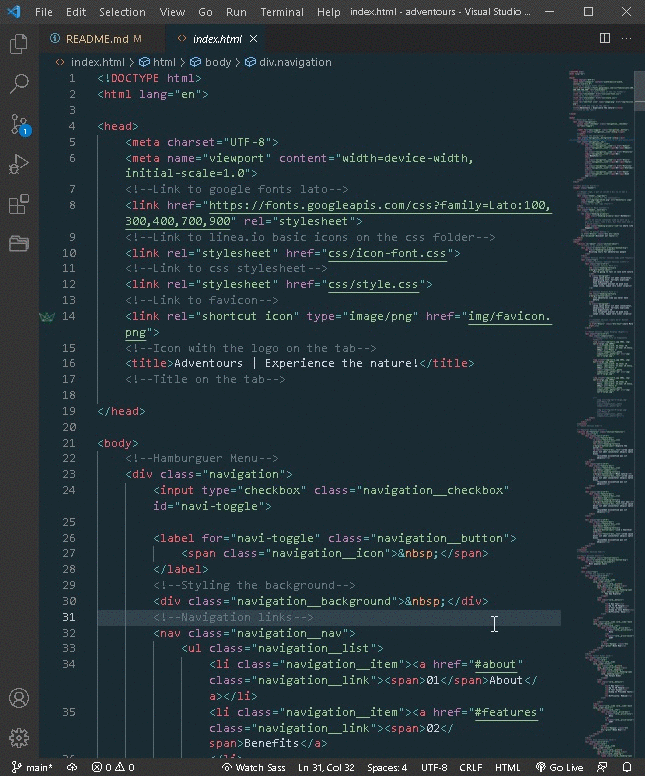

<h2 align="center"> Adventours Landing Page </h2>

<p align= "center">This readme is on working progress, if you have any doubts or suggestions, reach me on my socials.</p>

<h3 align="center"> Demo of how it works<h3>
<p align="center">
Click the demo preview and it will take you to the game!
<br>
<br>
<br>
<a href="https://lnce21.github.io/Adventours/" target="_blank"> </a>
</>
<br>
<h3 align="center"></h3>Install NPM Node SASS to compile the scss file into css
<br>
<br>

```bash
# Clone this repository
$ git clone https://github.com/LNCE21/Adventours.git

# Go into the repository
$ cd Adventours

# Install dependencies (NPM Node SASS)
$ npm install

# Install extension on VSCode
Ritwick Dey -Live Server-

# Run the app
1st On the terminal execute: npm run compile:sass
2nd Open the extension Live server and click on -Go Live-

```
<h3 align="center"> Demo of how to run it<h3>
<p align="center">
<br>

</>

